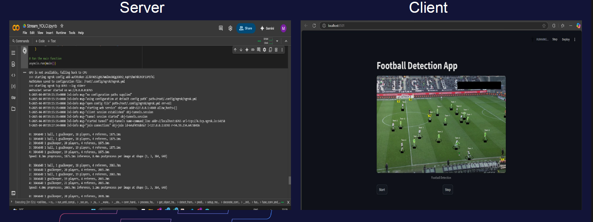

# Real-Time Player Impact Analyzer (RTPIA)

**Team Name:** اﻟﺴﺘﺪﻳﻮ اﻟﺘﺤﻠﻴﻠﻲ اﻟﻤﻤﺘﺎز (Elite Analytical Studio)  
**Team Members:** Yousif Ahmed Mohamed Saber  

---

## Table of Contents
1. [Project Overview](#project-overview)
2. [The Problem and Its Solution](#the-problem-and-its-solution)
3. [Idea Description](#idea-description)
4. [Data Used](#data-used)
5. [How Data Is Provided and Utilized](#how-data-is-provided-and-utilized)
6. [Technologies Used](#technologies-used)
7. [Goal Alignment](#goal-alignment)
8. [Demo and Testing](#demo-and-testing)
9. [Challenges and Future Work](#challenges-and-future-work)
10. [Project Code](#project-code)
11. [Thank You](#thank-you)

---

## Project Overview
The **Real-Time Player Impact Analyzer (RTPIA)** is an innovative tool designed to provide coaches and analysts with live insights into player contributions during soccer matches. By integrating Graph Neural Networks (GNNs) and computer vision, RTPIA delivers actionable, real-time performance metrics to enhance tactical decision-making.

---

## The Problem and Its Solution

### Problem
Coaches and analysts lack real-time insights into player contributions during soccer matches. Traditional post-game statistics fail to capture the dynamic impact of players—such as those who facilitate ball control or link attacks—leaving tactical adjustments delayed until after the match.

### Solution
RTPIA leverages a Graph Neural Network (GNN) to estimate **Expected Threat (ΔxT)** from live match events, enhanced by **YOLOv8** for real-time player and ball detection. This system delivers instant performance metrics, empowering coaches with mid-game tactical insights.

### Innovation
RTPIA combines cutting-edge GNNs with live computer vision, offering a pioneering approach to sports analytics. Unlike static post-game tools, it provides actionable insights during the match.

---

## Idea Description
RTPIA processes live video feeds to detect players and the ball, maps these to match events, and uses a GNN to predict ΔxT per player. This enables:
- **Instant Tactical Feedback:** Coaches can adjust strategies mid-game.
- **Hidden Contributors:** Identifies players with subtle but critical impacts (e.g., defensive pivots).
- **Market Value:** Targets soccer clubs and analysts in the growing $30B sports tech sector (projected by 2026).

**Process:**  
Live video → YOLO detects players/ball → Maps to event data → GNN predicts ΔxT per player.

---

## Data Used
This section details all data collected or generated during the project.

### Generated Data
- Real-time match events with ΔxT predictions, linking detected players to actions.

### Textual Data
1. **Wyscout Match Event Data:** Passes, tackles, etc., used to train the GNN on ΔxT.
2. **Sofascore Player Stats:** Season-long player statistics dataset.

### Non-Textual Data
1. **Live Video Feeds:** Processed by YOLO to detect players (bounding boxes) and ball positions.
2. **Roboflow Football Match Data:** Bounding box annotations for football players, ball, referees, and goalkeepers.

---

## How Data Is Provided and Utilized
- **Player-Specific Data:** Season-long statistics scraped from the Sofascore API.
- **Event Data:** Sourced from the Wyscout public dataset, converted to SPADL format to create player edges and calculate ΔxT per event.
- **Football Players Detection Dataset:** Labeled data from Roboflow, used to train the YOLOv8 model for object detection.

---

## Technologies Used
- **Python:** Core programming language.
- **YOLOv8:** Real-time player and ball detection from video streams.
- **PyTorch & PyTorch Geometric:** GNN (GoalNet) for ΔxT prediction.
- **Hardware:** GPU (e.g., NVIDIA Tesla T4) via Google Colab for real-time computation.

---

## Goal Alignment
- **Theme:** Improving Performance.
- **Fit:** Enhances player and team performance by delivering live ΔxT insights, enabling mid-game adjustments to boost win rates.

---

Watch the demo video for the yolo implementation: [RTPIA Demo](https://drive.google.com/file/d/13ji9yTMq4pa77tCjHZ9ifZaiewJjfJ71/view?resourcekey)

---

## Demo and Testing
- **Validation Methods:** Demos, screenshots, videos, and simulations.
- **Setup:** Server-client architecture for real-time processing.

---

## Challenges and Future Work

### Challenges
1. Detecting diverse match events in real time.
2. Ensuring a seamless real-time experience.

### What We Need Help With
- Access to more computing resources and better GPUs on Google Colab.

### Future Work
- Implement real-time event detection.
- Train the GNN on collected data.
- Enable per-player ΔxT predictions during live matches.

---

## Project Code
Available at: [https://github.com/M-saber31/AILeagueCode](https://github.com/M-saber31/AILeagueCode)

---

## Thank You
We appreciate your interest in RTPIA! For questions or collaboration, feel free to reach out.